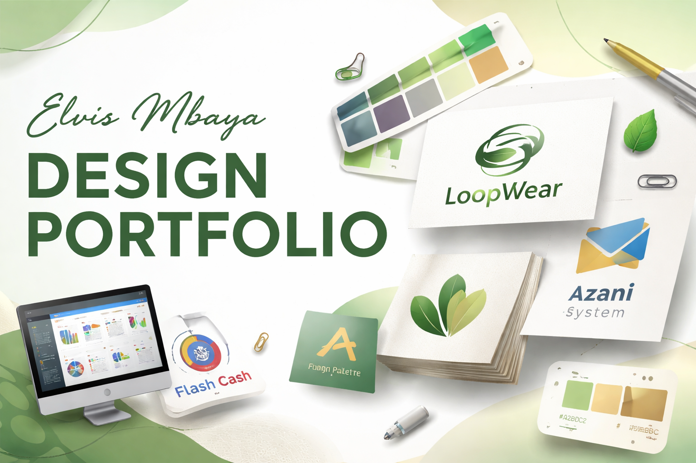

# 🎨 Elvis Mbaya — Design Portfolio

Welcome to my creative space — a collection of logos, thumbnails, and visual designs crafted to bring ideas to life.

This repository showcases my work in **branding, visual identity, and digital design**, complementing my technical background in data and systems development.

  

---

## 🧠 Design Philosophy

I design with one goal in mind:

> **Clarity + Aesthetic = Impact**

Every piece you see here is created to:
- Communicate clearly
- Capture attention instantly
- Maintain clean, modern visual balance

---

## 🖼️ Featured Designs

### 🌿 LoopWear Brand Identity

A sustainable fashion brand focused on recycling and upcycling clothing.

**Design Concept:**
- Earthy tones (green & brown) to reflect sustainability
- Modern, clean typography
- Subtle 3D depth for premium feel

---

### 🌿 Business Card

A business card based on one of the fictional companies (Flash-Cash Services) that I already covered in a separate project in my portfolio.

**Design Concept:**
Color Palette: The black and gold combination creates a sense of prestige and exclusivity, which is essential for a financial services brand. 

• Symbolism: The shield logo represents security and protection, while the central dollar sign immediately identifies the industry as lending or capital management.
• Modern Professionalism: The use of 3D icons and a "high-tech" finish reflects a preference for clean, digital-first design often found in modern banking.
• Accessibility: A prominent QR code and WhatsApp icon suggest a streamlined, efficient application process for clients.
• Authority: Serif typography for the name and "CEO" title establishes a clear hierarchy and a professional point of contact.

---

### 📊 Project Thumbnails Collection

A series of custom thumbnails designed for dashboards and data projects.

**Focus Areas:**
- Strong visual hierarchy
- Clean layout for readability
- Consistent color systems

  1. YOUTUBE THUMBNAIL 30-DAY Progress
    

---

### 🧩 Custom Logos

A collection of logos designed for various projects and concepts.

**Styles Included:**
- Minimalist
- 3D branding
- Modern flat design

---

## 🛠️ Tools & Techniques

- 🎨 Color Theory & Branding
- 🧱 Layout & Composition
- 🖥️ Design Tools (e.g., Photoshop, Illustrator, Canva)
- ✨ 3D-style visual enhancement
- 📐 Consistency in visual systems

---

## 🚀 How This Connects to My Tech Work

My design skills enhance my technical projects by:
- Creating **clean, professional dashboards**
- Designing **engaging GitHub presentations**
- Improving **user experience & visual clarity**

This makes my work not just functional — but *memorable*.

---

## 📁 Structure
